Note: if any student find this repository for his/her college course, DO NOT copy directly.   
注意： 如果有哪位学弟学妹发现了这个仓库，千万不要直接抄下来，可能会有你意想不到的情况发生。

# Travel Plan
This project finished a toy travel planner in China during COVID-19 time. (just for fun)

Actually, it's just a Data Structure course project in BUPT. 

**Simple DFS algorithm, Complicated function. lol**

# Outline

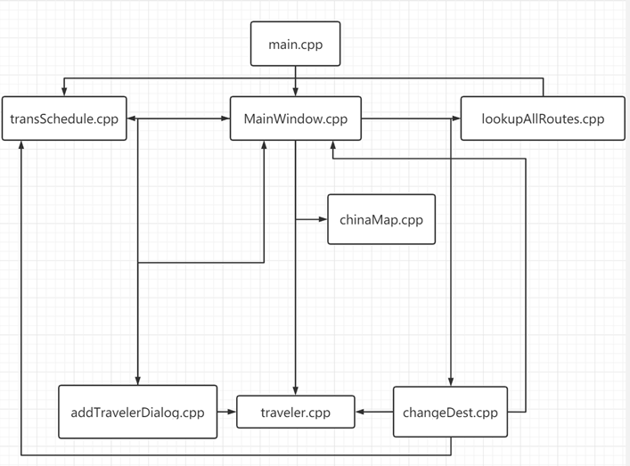

# Schedule Table
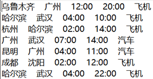

# Example

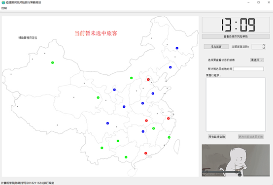

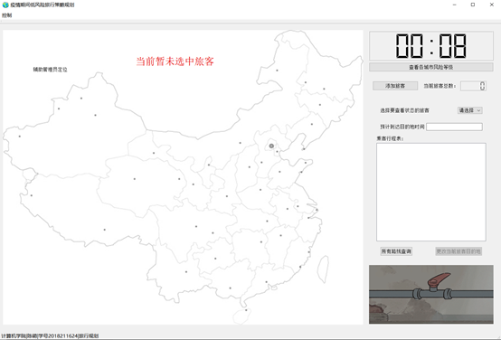

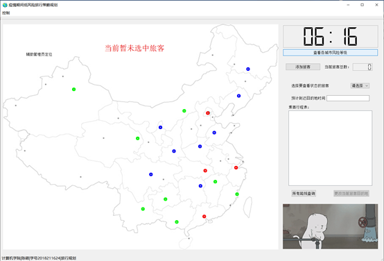

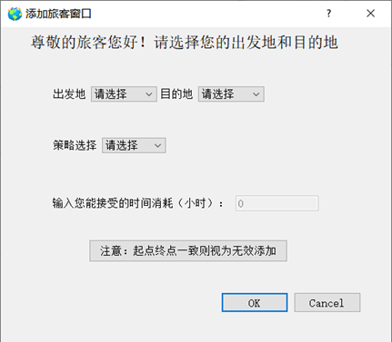

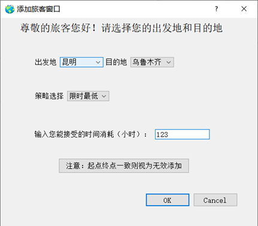

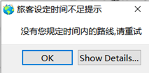

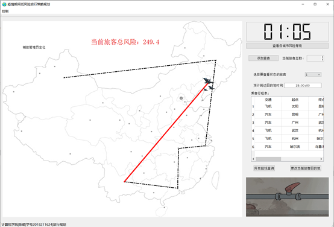

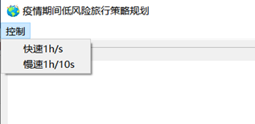

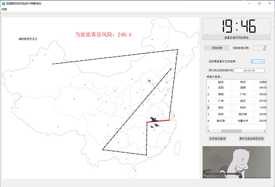

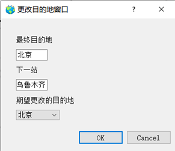

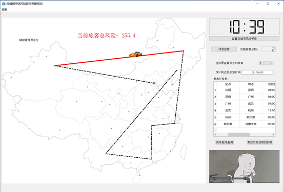

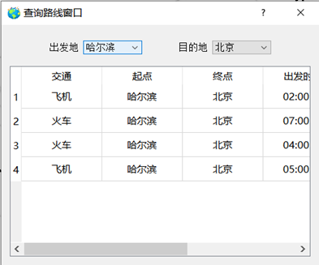

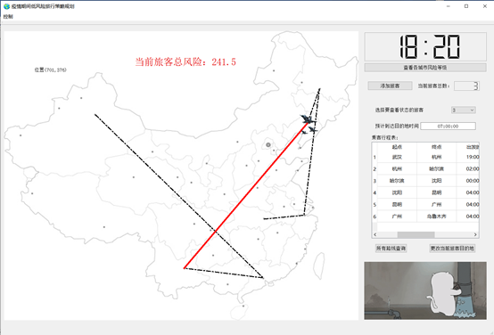